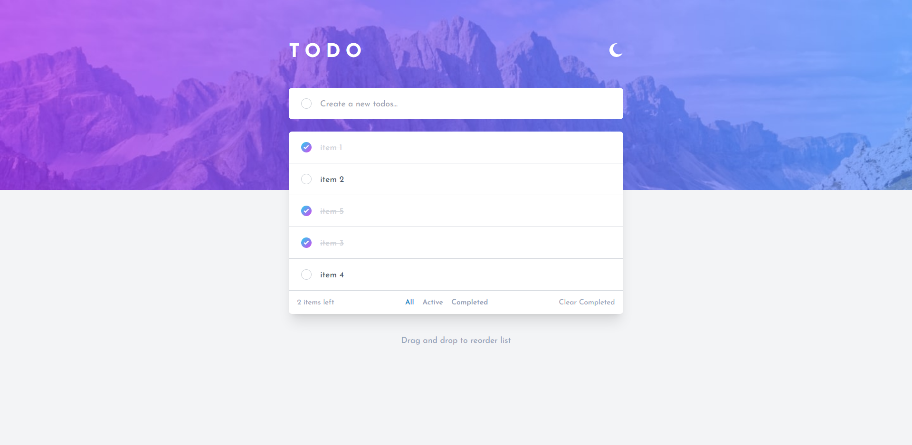
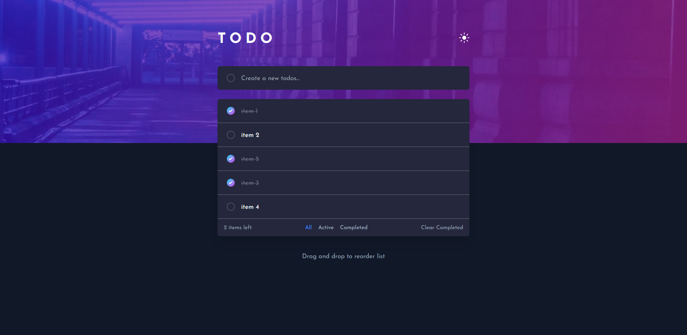

# React Todos - Frontend Mentor

A simple todo app designed by Frontend Mentor, you can see the full description on [here](https://www.frontendmentor.io/challenges/todo-app-Su1_KokOW).

## Screenshots

## Motivation

I read some articles saying that we should try to make our React components as independent as possible. For example, if we want to create a `List` component to list our todos, we should not implement the logic about manipulating todos inside this component. Doing so will make our `List` component non-reusable.

To make the `List` component more reusable, we can implement the logic about manipulating todos in its parent component, and pass the todos data to it. All the `List` component should do is to list the data which are passed by its parent component. As a result, if we want the `List` component to list the other data, we can just pass the data to it.

I totally agree with this design pattern, so I built this project to practice this pattern.

## Structure

All states about todos are managed by the component in `App.tsx`, including add, delete, remove, filter and the functionality of drag and drop. Those components, which are used to display the information of the todos, do not have their own state because what they need to do is just render the todos data onto the screen.

Another component has its own state is `Header` component, which is implemented in `Header.tsx`. It manage the theme of this app.

**This project is not a fullstack project, the data are stored in the local storage**.

## Built with

- React
- Tailwind CSS
- Vite
